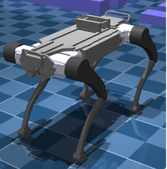

# RBQ Robot (MJCF Model)

> **⚠️ Requires [MuJoCo](https://mujoco.readthedocs.io/) version 3.3.0 or later.**

## 📄 Overview

This repository provides a simplified MJCF (MuJoCo XML) model of the [RBQ](https://rainbowrobotics.github.io/RBQ/), a 12-degree-of-freedom (DoF) quadruped robot developed by **Rainbow Robotics**.

  

The model is designed for use in simulation environments such as [MuJoCo](https://mujoco.readthedocs.io/) and is suitable for control algorithm development, reinforcement learning, and robotics research.

## 📁 Contents

- `configs/enviroment.xml`: playground for RBQ robot  
- `configs/rbq.xml`:  configs RBQ robot model  
- `configs/rbq_enviroment.xml`: Main MJCF file for the RBQ robot model  
- `meshes/`: Directory containing mesh and texture files  

## 📜 License

This project is licensed under the [Apache-2.0 License](LICENSE).  
You are free to use, modify, and distribute it under the terms of this license.

## 📚 Citation

If you use this model in your research or publication, please consider citing Rainbow Robotics.  
Citation details will be added once an official publication is available.

## URDF → MJCF derivation steps

1. Converted the DAE [mesh
   files](https://github.com/unitreerobotics/unitree_ros/tree/master/robots/go2_description/meshes) to OBJ format using [Blender](https://www.blender.org/).
   - When exporting, ensure "up axis" is `+Z`, and "forward axis" is `+Y`.
2. Processed `.obj` files with [`obj2mjcf`](https://github.com/kevinzakka/obj2mjcf).
3. Added `<mujoco> <compiler discardvisual="false" strippath="false" fusestatic="false"/> </mujoco>` to the URDF's
   `<robot>` clause in order to preserve visual geometries.
4. Loaded the URDF into MuJoCo and saved a corresponding MJCF.
5. Added a `<freejoint/>` to the base.
6. Manually edited the MJCF to extract common properties into the `<default>` section.
7. Softened the contacts of the feet to approximate the effect of rubber and
   increased `impratio` to reduce slippage.
8. Added `scene.xml` which includes the robot, with a textured groundplane, skybox, and haze.

